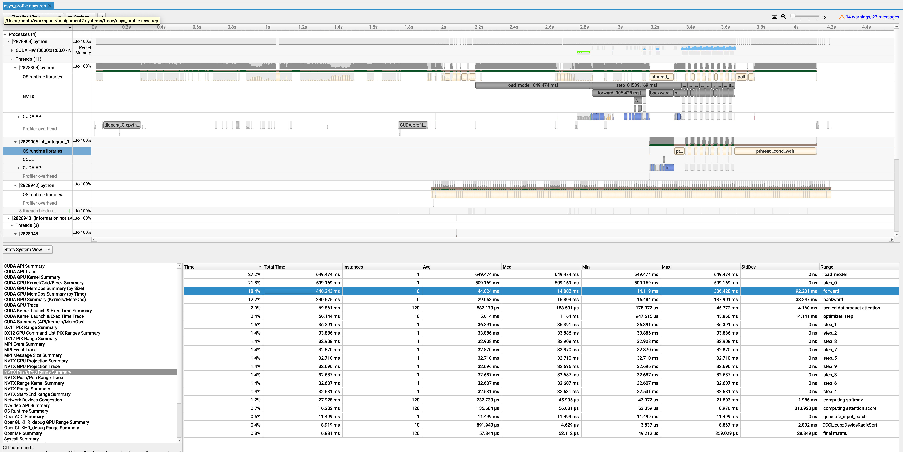
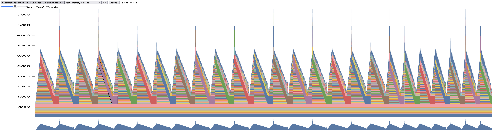
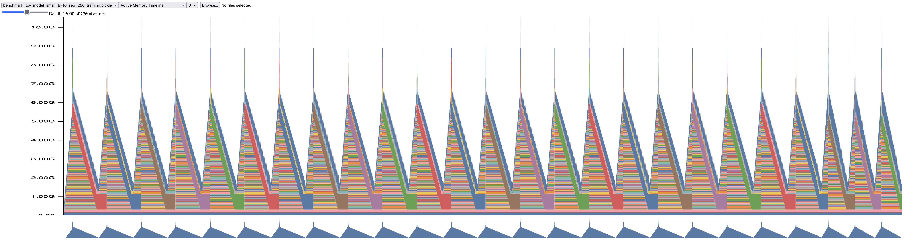
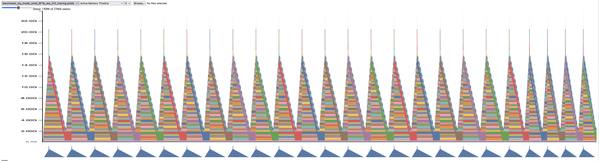
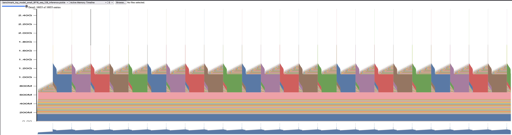
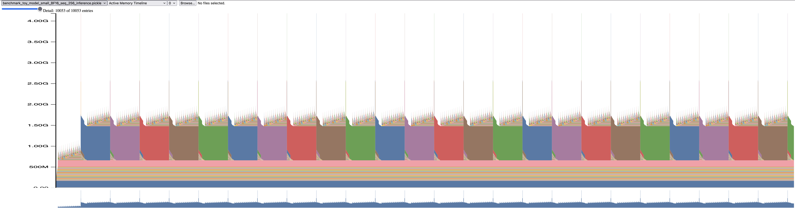
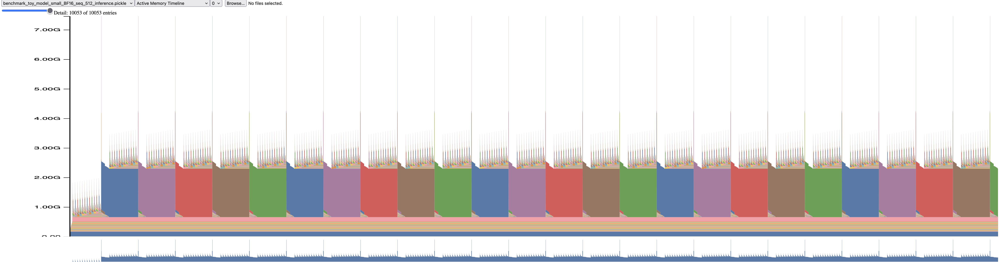
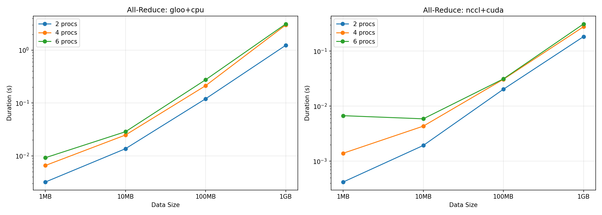
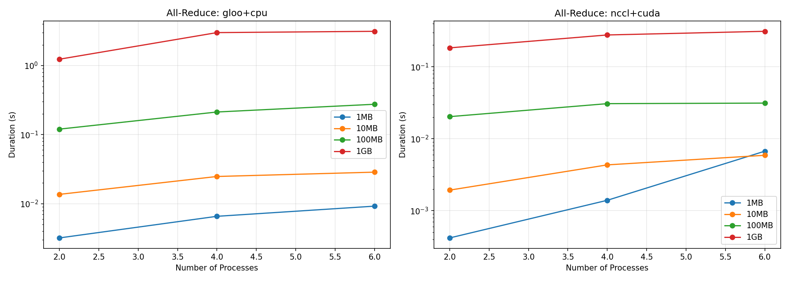
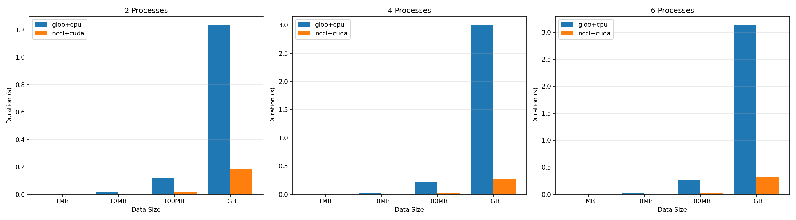

**Problem `benchmarking_script`:**

Please see [./cs336_systems/benchmark_grid.py](./cs336_systems/benchmark_grid.py) for
the end-to-end benchmarking of the forward and backward passes.

Running on a single H200 SXM node gives following
results [mlflow](https://mlflow.sutroplanet.com/#/compare-runs?runs=[%22d4002721711e4d068c96b198ea7248d6%22,%223721f86d926c49499237b94bc80f5f71%22,%22676ade9594d14b5083c809b2819c2f30%22,%22cde59887fc694de1ac7fac76b12f217e%22,%22da1852caa3504bcb9ee5de52d241d4c8%22]&experiments=[%22131%22]).
As we can see, as the model size increase, both forward pass and backward pass elapses increase. The standard deviation
of elapses is relatively small.

Without warmup steps, the initial steps have longer forward/backward pass elapses.

**Problem `nsys_profile`:**

The following results are from running forward/backward for an LM with `d_model=128 and context_len=128` using
script [./cs336_systems/nsys_profile.py](./cs336_systems/nsys_profile.py). The resulting trace
is [./trace/nsys_profile.nsys-rep](./trace/nsys_profile.nsys-rep).
The total forward pass time is 440.243ms. It matches with the results from python `timeit` library.



The CUDA kernel takes the most cumulative GPU time is
`void cutlass::Kernel2<cutlass_80_simt_sgemm_128x128_8x4_tn_align1>(T1::Params)` during forward pass. It is invoked 60
times for every forward pass. For backward pass, it is the same kernel that takes the most of time.

I saw another contributor of kernels are `OpScalar` type, probably related to

```text
NVTX Range	Style	PID	TID	NVTX Inst	Kern Inst	Total Time	Avg	Med	Min	Max	StdDev	Kernel Name
:forward	PushPop	2828803	2828803	1	146	363.520 μs	2.489 μs	2.592 μs	1.984 μs	2.688 μs	216 ns	void at::native::elementwise_kernel<(int)128, (int)2, void at::native::gpu_kernel_impl_nocast<at::native::BinaryFunctor<float, float, float, at::native::binary_internal::MulFunctor<float>>>(at::TensorIteratorBase &, const T1 &)::[lambda(int) (instance 1)]>(int, T3)
:forward	PushPop	2828803	2828803	1	72	137.888 μs	1.915 μs	1.824 μs	1.792 μs	2.144 μs	137 ns	void at::native::elementwise_kernel<(int)128, (int)2, void at::native::gpu_kernel_impl_nocast<at::native::direct_copy_kernel_cuda(at::TensorIteratorBase &)::[lambda() (instance 3)]::operator ()() const::[lambda() (instance 7)]::operator ()() const::[lambda(float) (instance 1)]>(at::TensorIteratorBase &, const T1 &)::[lambda(int) (instance 1)]>(int, T3)
```

**Problem `mixed_precision_accumulation`:** The result is

```text
tensor(10.0001) # Takeaway: even in FP32, iterative summation of a non‑exact decimal can drift by ~1e‑4 after 1000 adds.
tensor(9.9531, dtype=torch.float16)  # Takeaway: FP16 accumulation loses lots of precision near 10 because the step size is ~0.0078. You’re seeing accumulation error dominate.
tensor(10.0021)  # Takeaway: with an FP32 accumulator, you remove per‑step rounding in the sum, but if your inputs are FP16 you still inherit input quantization error.
tensor(10.0021) # Same as (3): You explicitly do what PyTorch would have done implicitly. The addend’s value is the FP16‑rounded 0.01000213623046875, the accumulation is in FP32, and you get the same 10.00213623046875.
```

**Problem `benchmarking_mixed_precisions`:**

(a) The script is located at [./cs336_systems/playground/toy_model.py](./cs336_systems/playground/toy_model.py). The
output from the script looks like

```text
1. Model parameter dtypes (within autocast context):
   fc1.weight: torch.float32
   ln.weight: torch.float32
   ln.bias: torch.float32
   fc2.weight: torch.float32

2. Output of first feed-forward layer (fc1):
   dtype: torch.float16

3. Output of layer norm (ln):
   dtype: torch.float32

4. Model's predicted logits:
   dtype: torch.float16

5. Loss:
   dtype: torch.float32
   value: 1.6761

6. Model's gradients:
   fc1.weight.grad: torch.float32
   ln.weight.grad: torch.float32
   ln.bias.grad: torch.float32
   fc2.weight.grad: torch.float32
```

From the output we can see, all model parameters + gradients are in full fp32 precision.
Part of the activations (output of linear layer, predicted logics) are in half-precision fp16.

(b) LayerNorm is sensitive to precision issues in fp16 because it computes statistics (mean and variance)
that requires careful numeric stability. If amp using bfloat16, the output looks like the following. With bf16 we still
treat
reductions LayerNorm specially and usually compute these statistics in fp32.

```text
1. Model parameter dtypes (within autocast context):
   fc1.weight: torch.float32
   ln.weight: torch.float32
   ln.bias: torch.float32
   fc2.weight: torch.float32

2. Output of first feed-forward layer (fc1):
   dtype: torch.bfloat16

3. Output of layer norm (ln):
   dtype: torch.float32

4. Model's predicted logits:
   dtype: torch.bfloat16

5. Loss:
   dtype: torch.float32
   value: 1.6912

6. Model's gradients:
   fc1.weight.grad: torch.float32
   ln.weight.grad: torch.float32
   ln.bias.grad: torch.float32
   fc2.weight.grad: torch.float32
```

(c) Script is located
at [./cs336_systems/playground/benchmark_toy_model.py](./cs336_systems/playground/benchmark_toy_model.py).

```text
================================================================================
SUMMARY: Total Time (Forward + Backward) in milliseconds
================================================================================
Model Size          FP32        BF16        FP16
--------------------------------------------------------------------------------
small             99.847      44.425      40.442
medium           250.808     105.750      99.667
large            492.850     181.815     168.906
xl                   N/A     358.321         N/A
2.7B                 N/A         N/A         N/A


================================================================================
SPEEDUP ANALYSIS: Mixed Precision vs FP32
================================================================================
Model Size     BF16 Speedup   FP16 Speedup
--------------------------------------------------------------------------------
small                  2.25x           2.47x
medium                 2.37x           2.52x
large                  2.71x           2.92x
xl                      N/A            N/A
2.7B                    N/A            N/A
```

As the model becomes larger, the speedup of using mix-precision becomes more significant. BF16 and FP16 tends to have
similar speed-up.

**Problem `memory_profiling`:**

(a) Profiling memory during training with `small` LM gives following usage graph, running with seq_len=128,256,512
respectively. From the training mem trace, you can easily tell the backward pass starts right after the peek which
brings in gradients usage.







For inference only, respectively







(b) Peak memory grows roughly linearly with sequence length during the forward pass. The full training step uses several
times more memory than inference (to store activations, gradients, and optimizer state), and the peak scales more
steeply with context length (about 4–5× from 128→512).

| Context length | Peak memory – **forward only** | Peak memory – **full training step** (fwd + bwd + opt) |
|----------------|--------------------------------|--------------------------------------------------------|
| **128**        | ≈ **1.3 GB**                   | ≈ **4.5 GB**                                           |
| **256**        | ≈ **1.6 GB**                   | ≈ **9 GB**                                             |
| **512**        | ≈ **2.7 GB**                   | ≈ **20 GB**                                            |

(c) Yes, mixed precision helps reduce the size of activations if you compare
`benchmark_toy_model_small_BF16_seq_128_training` vs `benchmark_toy_model_small_FP32_seq_128_training`. The reduction is
more significant and linear for the inference-mode.

(d) For the `small` model, in theory there are 1.4e8 parameters which gives you 560M mem usage if loaded with
full-precision.

**Problem `pytorch_attention`:**

Running script [./scripts/run_benchmark_attn.sh](./scripts/run_benchmark_attn.sh) gives following
benchmarking result [./trace/benchmark_attn.txt](./trace/benchmark_attn.txt) on a H200 machine, the peak reserved memory
usage
is around 65GB.

With JiT, the benchmarking result is at [./trace/benchmark_attn_jit.txt](./trace/benchmark_attn_jit.txt) where we can
see the 2-3x speedup.

**Problem `distributed_communication_single_node`:**

I have written a benchmarking and plotting script
at [./cs336_systems/playground/distributed/all_reduce_benchmark.py](./cs336_systems/playground/distributed/all_reduce_benchmark.py).
Running on an instance w/ 6 RTX 5090s yields following results.

| Duration vs Data Size                                                        | Duration vs Num Processes                                                    | Backend Comparison                                                                       |
|------------------------------------------------------------------------------|------------------------------------------------------------------------------|------------------------------------------------------------------------------------------|
|  |  |  |

Findings:

* NCCL+CUDA is significantly faster than Gloo+CPU
* Duration scales roughly linearly with data size (both backends)
* More processes increases duration, but modestly
* NCCL has higher fixed overhead for small messages


